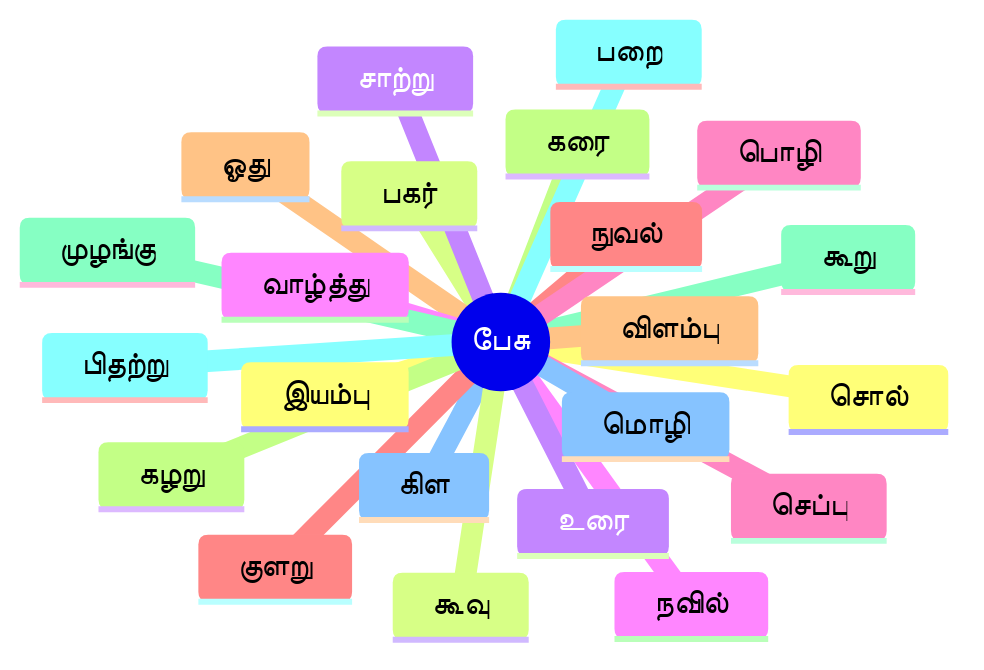

### பேசுதல் - 

```mermaid 
  mindmap
  root((பேசு))
    சொல்
    பகர் 
    சாற்று
    நவில்
    செப்பு
    நுவல்
    ஓது
    கரை
    கூறு
    பறை
    கிள
    இயம்பு
    கூவு
    உரை
    வாழ்த்து
    பொழி
    குளறு
    விளம்பு
    கழறு
    முழங்கு 
    பிதற்று
    மொழி
```
