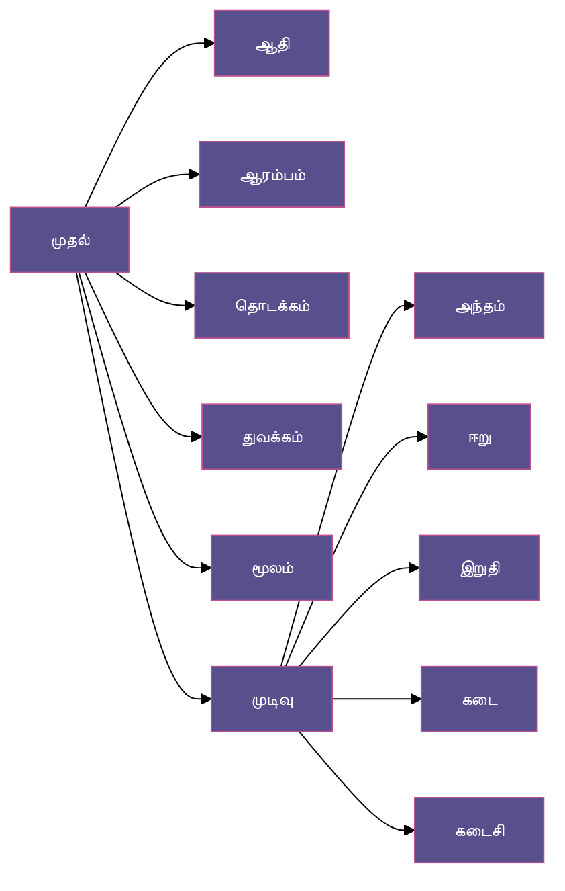

### முதலும் முடிவும்

```mermaid 
%%{init: 
{
  "theme": "forest",
  "themeVariables": {
    "darkMode": false,
    "nodeBorder" : "#bc5090",
    "mainBkg" : "#58508d",
    "actorBkg" : "#01A6F0",
    "signalColor" : "#F34F1C",
    "textColor" : "#FFFFFF",
    "loopTextColor" : "#C7C7C7",
    "labelTextColor" : "#C7C7C7",
    "labelBoxBorderColor" : "#7FBC00",
    "labelBoxBkgColor" : "#7FBC00",
    "noteBkgColor" : "#FFBA01",
    "noteBorderColor": "#FFBA01",
    "fontFamily": "Verdana",
    "fontSize": "13px"
 }
}
}%%

flowchart LR   

A["முதல்"]  -->  B["ஆதி"]
A -->  B1["ஆரம்பம்"]
A -->  B2["தொடக்கம்"]		
A -->  B3["துவக்கம்"]
A -->  B4["மூலம்"]
A  -->  EA["முடிவு"]  -->  EB["அந்தம்"]
EA -->  EB1["ஈறு"]
EA -->  EB2["இறுதி"]
EA -->  EB3["கடை"]
EA -->  EB4["கடைசி"]

```
